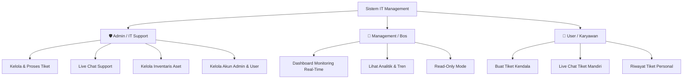

# 🚀 IT Helpdesk & Ticketing System with Live Chat

[](https://laravel.com)
[](https://php.net)
[](https://adminlte.io)
[](https://getbootstrap.com)
[](https://opensource.org/licenses/MIT)

> **Sistem Manajemen Tiket Kendala IT, Inventaris Aset, dan Komunikasi Real-Time Dua Arah (Live Chat)** yang dirancang untuk mempercepat respon penanganan masalah teknis dan menyajikan analitik performa IT secara instan.

---

## 📌 Daftar Isi
- [Tentang Aplikasi](#-tentang-aplikasi)
- [Fitur Utama](#-fitur-utama)
- [Keunggulan Aplikasi](#-keunggulan-aplikasi)
- [Struktur Hak Akses & Role](#-struktur-hak-akses--role)
- [Detail Role & Akun Pengguna](#-detail-role--akun-pengguna)
- [Spesifikasi Teknologi](#-spesifikasi-teknologi)
- [Panduan Instalasi](#-panduan-instalasi)
- [Menjalankan Automated Testing](#-menjalankan-automated-testing)
- [Lisensi](#-lisensi)

---

## 📖 Tentang Aplikasi
**IT Helpdesk & Ticketing System** adalah platform terintegrasi yang menjembatani komunikasi antara karyawan (*end-user*) dan tim IT Support perusahaan. Sistem ini dilengkapi dengan portal pelaporan kendala mandiri, live chat interaktif dengan status pengiriman pesan, dashboard monitoring real-time untuk level pimpinan (*management*), serta manajemen inventaris aset perangkat IT.

---

## ✨ Fitur Utama

### 1. 💬 User Portal & Instant Ticketing
- **Pengajuan Tiket Cepat**: Pelaporan kendala tanpa proses login yang rumit; otomatis mendeteksi identitas pengguna berdasarkan *Serial Number* (SN) / No. Laptop.
- **Live Chat Dua Arah**: Komunikasi langsung dengan teknisi pada setiap tiket tanpa perlu me-refresh halaman web.
- **Tanda Pesan Terbaca (Read Receipts)**: Dilengkapi status centang dua (abu-abu = terkirim, biru = sudah dibaca oleh admin/user).
- **Lampiran Gambar & Screenshot Paste**: Mendukung unggah foto bukti kendala atau langsung *paste* screenshot dari clipboard.
- **Pelacakan Status Real-Time**: Status tiket transparan (*Open*, *On Progress*, *Pending*, *Closed*, *Cancelled*) beserta alasan penundaan/pending.

### 2. 📊 Real-Time Admin & Executive Dashboard
- **Auto-Sync Metrik Real-Time**: Data tiket dan statistik diperbarui otomatis di latar belakang tanpa reload halaman.
- **Smart Resource Throttling**: Mengoptimalkan konsumsi sumber daya server dengan mengatur interval request saat browser diminimize/tidak aktif.
- **Kartu Indikator Interaktif**: Badge metrik (*Open, On Progress, Pending, Close, Cancel*) dapat diklik untuk langsung membuka filter tiket yang sesuai.
- **Grafik Analitik Interaktif**:
  - Tren tiket harian (14 hari terakhir).
  - Distribusi kategori kendala (*Hardware, Software, Network, Other*).
  - Statistik beban kerja teknisi dan riwayat tiket per perangkat laptop.

### 3. 👥 Manajemen Pengguna & Hak Akses (Multi-Role)
- **Role Khusus Management (Bos)**: Mode monitoring dashboard eksekutif secara *read-only* tanpa opsi mengubah tiket/data aset.
- **Role Admin / IT Support**: Akses penuh penanganan tiket, manajemen inventaris, dan konfigurasi sistem.
- **Role User / Karyawan**: Pembuatan tiket kendala operasional, tracking status mandiri, dan komunikasi live chat.
- **Menu Kelola Admin**: Manajemen akun administrator secara mandiri dengan perlindungan anti-hapus akun sendiri (*self-delete protection*).

---

## 🌟 Keunggulan Aplikasi

| Keunggulan | Deskripsi |
|---|---|
| ⚡ **Zero-Friction Submission** | User tidak perlu mengingat username/password akun untuk lapor kendala. |
| 🔄 **Live Sync Tanpa Refresh** | Percakapan live chat dan metrik statistik diperbarui otomatis secara instan. |
| 🛡️ **Role-Based Security** | Akses dibatasi ketat menggunakan Middleware & Authorization Gates Laravel. |
| 📈 **Executive Visibility** | Pimpinan dapat memantau produktivitas dan kepuasan layanan IT kapan saja secara real-time. |
| 🧪 **High Reliability** | Dilengkapi dengan pengujian otomatis (*Automated Feature Tests*) untuk menjamin kestabilan sistem. |

---

## 🔐 Struktur Hak Akses & Role



---

## 👥 Detail Role & Akun Pengguna

| Role | Deskripsi Hak Akses | Area / URL Utama |
|---|---|---|
| **🛡️ Admin** | Akses penuh: manajemen tiket, update status, live chat admin, modul inventaris aset, kelola user, dan kelola admin. | `/admin/dashboard`<br>`/admin/tickets`<br>`/admin/inventory`<br>`/admin/users`<br>`/admin/admins` |
| **👔 Management** | Monitoring performa dan analitik eksekutif secara *read-only*. Tidak memiliki akses untuk memodifikasi tiket maupun data aset. | `/admin/dashboard`<br>`/admin/dashboard/realtime` |
| **👤 User** | Akses portal pelaporan tiket kendala mandiri, live chat dengan teknisi, serta riwayat tiket pribadi. | `/portal`<br>`/ticket/{id}`<br>`/my-tickets` |

---

## 🛠️ Spesifikasi Teknologi

- **Backend Framework**: [Laravel 12](https://laravel.com)
- **Bahasa Pemrograman**: [PHP 8.2+](https://php.net)
- **Database**: MySQL 8.0+ / MariaDB 10.4+ (Mendukung SQLite untuk Automated Testing)
- **Template & UI Admin**: [AdminLTE 3](https://adminlte.io) berbasis [Bootstrap 4](https://getbootstrap.com) & FontAwesome 6
- **Frontend Portal User**: Modern Responsive UI berbasis Bootstrap 5 & FontAwesome 6
- **Visualisasi Data**: [Chart.js](https://www.chartjs.org)
- **Real-Time Polling Engine**: Optimized AJAX dynamic background poller dengan Page Visibility API
- **Testing Framework**: [Pest PHP](https://pestphp.com) & [PHPUnit](https://phpunit.de)

---

## 🚀 Panduan Instalasi

### 1. Prasyarat Sistem
Pastikan perangkat Anda telah terpasang:
- PHP >= 8.2
- Composer
- Node.js & NPM
- MySQL / MariaDB Server

### 2. Clone Repositori
```bash
git clone https://github.com/kowiyuliman/ticketingsystem-withlivechat.git
cd ticketingsystem-withlivechat
```

### 3. Instal Dependensi Backend & Frontend
```bash
composer install
npm install
```

### 4. Konfigurasi Environment (`.env`)
Salin file `.env.example` menjadi `.env`:
```bash
cp .env.example .env
```
Sesuaikan konfigurasi database pada `.env`:
```env
DB_CONNECTION=mysql
DB_HOST=127.0.0.1
DB_PORT=3306
DB_DATABASE=mptb_it-management
DB_USERNAME=root
DB_PASSWORD=
```

### 5. Generate Application Key & Migrasi Database
```bash
php artisan key:generate
php artisan migrate
```

Untuk menambahkan data awal (seeder admin default):
```bash
php artisan db:seed
```

### 6. Build Aset & Jalankan Server Lokal
```bash
# Terminal 1 - Jalankan server Laravel
php artisan serve

# Terminal 2 - Jalankan asset bundler
npm run dev
```
Aplikasi dapat diakses melalui browser di: `http://127.0.0.1:8000`

---

## 🧪 Menjalankan Automated Testing
Untuk memverifikasi seluruh modul berjalan tanpa error:
```bash
php artisan test --filter="UserManagementTest|AdminManagementTest|AdminDashboardTest|ManagementRoleTest|UserPortalTest"
```

---

## 📄 Lisensi
Aplikasi ini dirilis di bawah lisensi [MIT License](LICENSE).
